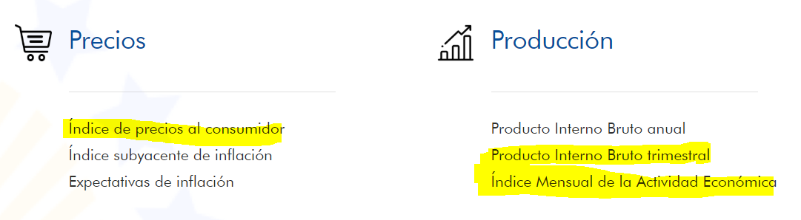
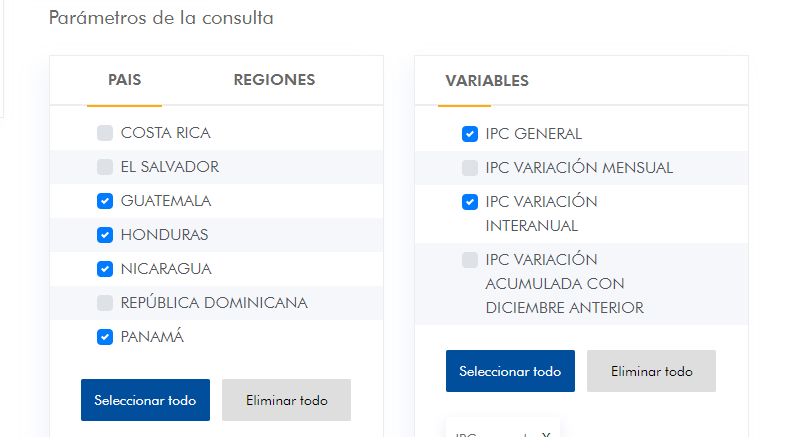

# FWL-GFF 

## Resumen FWL Tasa Vencidos
Todo el script se trata de unificar los datos historicos de la cartera crediticia, 
hacer un tratamiento de los datos, eliminando valores nulos.
La idea principal es obtener ratio de obligaciones en situación de default por mes,
para lo cual se requiere:
    Segmentar las obligaciones por tipo de crédito (Consumo, Corporativo, Vivienda).
    Obtener un conteo de obligaciones vencidas por segmento (con dias de mora superior a 90 dias).
    Obtener un conteo un conteo del total de obligaciones por segmento.

    Tasa Vencidos = Total Vencidas/Total Obligaciones

## Resumen FWL Seleccion de Modelo 

La variable objetivo (variable a predecir) es la tasa de vencidos, para estimar esta variable se consideran otras variables macro que pudieran influir en la tasa de vencidos.
Para el caso de Honduras se consideran: 
- IMAE
- IMAE_var
- IPC
- IPC_var
- Tasa_interes_MN
- Remesas
- PIB
- PIB_var

Estas variables se extraen del portal del SECMCA (ver imagenes)

Para el caso de PIB_var, se toma el dato del PIB trimestral y manualmente se calcula el porcentaje de variación con respecto al dato del año anterior:

    PIB_var = [ PIB(Año 1) - PIB(Año 0) ] / PIB(Año 0)

Se realiza una interpolación del PIB para tener un dato de manera mensual y poder unificarlo con las demás variables macro.

Se realiza el preprocesamiento necesario para algunos modelos predictivos.

Se entrena una batería de modelos, considerando variables exogenas, 
combinaciones de estas y sub dividiendo los datos, lo que se persigue es realizar una matriz de las métricas resultantes de estos modelos, 
para posteriormente filtrarlos por logica de negocio y valores de estas métricas, obtenieno una matriz reducida con los modelos que cumplen con las pruebas y que se podrían implementar.

Se escoge el mejor modelo, tratando de priorizar un modelo de Regresión Lineal
con PIB_var como variable independiente 

## Resumen FWL Escenarios Macroeconómicos

El motivo principal de este paso es generar escenarios futuros para la variable independiente (PIB_var)
para lo cual se requiere de la información del FMI/WEO referente e las proyecciones de la variable independiente hasta 2028.

Para obtener el dato mensual de las variaciones del PIB, se calcula la diferencia entre un año y el siguiente, y esta diferencia se divide entre 12 para distribuirlo uniformemente.
    
    diferencia = (pib_actual - pib_anterior) / 12
Para los meses de Enero a Noviembre, se incrementa el valor actual por el dato que se obtuvo del cálculo anterior.

Para generar los escenarios Pesimista y Optimista, se requiere obtener la desviación estándar de la serie neutral, a esta serie neutral, se le suma una desviación estándar y así se obtiene el escenario Optimista, para el escenario pesimista a la serie neutral se le resta una desviación estándar.

Suavizamiento:
Para los primeros meses de predicciones, un aumento de su valor en una desviación estándar es demasiado abrupto y poco realista,
por lo cual se realiza un suavizamiento de los valores optimistas y pesimistas por un año, para lo cual se utiliza la siguiente formula:
    
    pib_var_std = std_dev * sqrt(month / 12) 

donde:
- month se refiere al numero del mes a predecir, por ejemplo, si Octubre es el primer mes a predecir, este sería el mes 1
- sqrt se refiere a la raíz cuadrada
- std_dev es la desviación estándar de la serie neutral

Como siguiente paso, se requiere calcular los pesos para los escenarios

Para la ponderación de pesos macroeconómicos utilizamos las fechas históricas de las variables macroeconómicas. Para los pesos primero se definen unos rangos con la data historica de la variable macro utilizada usando la siguiente fórmula:
- Rango mínimo: min valor  + (max valor - min valor)/3
- Rango máximo: valor máximo de la data
- Rango mediano: Rango min – (max valor – min valor)/3
  
para luego obtener el conteo de los valores de la variable que se encuentren en cada rango siendo los cuales estan definidos de la siguiente manera para los escenarios optimista, pesimista y neutral:

- Conteo pesimista: Conteo de observaciones menores al rango mínimo.
- Conteo optimista: Conteo de observaciones mayores o iguales al rango medio
- Conteo neutral: Conteo de observaciones mayores o iguales al rango mínimo y menores al rango máximo.
 

Definción de pesos de los escenarios
Después se divide el conteo para cada rango entre el total de las observaciones y esto nos da el porcentaje respectivo para los pesos de cada escenario.

## Resumen FWL Ejecución de Modelo

1. Se leen las proyecciones de la variable independiente (PIB_var) 
2. Se leen los parámetros resultantes del modelo escogido (esto se guardó en el paso 2. Selección del Modelo) 
3. Se carga el historico de la variable independiente y dependiente. 
4. Se realizan los rezagos requeridos para cada modelo (el número de rezagos se determinó en el paso 2. Selección del Modelo)

5. Se reentrena el mejor modelo con los parámetros que se leyeron previamente.
6. Se obtiene las predicciones para cada escenario

7. Se obtiene el valor ancla, el cual es el último valor real obtenido
8. Se dividen los valores de las predicciones entre el valor ancla

Como paso final, se añaden algunos campos como el tipo de crédito y el país, luego se exportan estos resultados.
